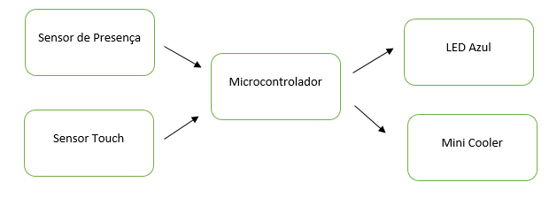

# homeautobot

## Projeto 1 - Mundo Digital
Filipe Borba, Gabriel Moreira, Hugo Mendes

## Materiais

* Microcontrolador SAME 70
* Sensor de Presença/Movimento
* LED verde
* Sensor Touch Capacitivo TTP223B
* Mini Cooler

## Descrição do Projeto
Nosso projeto consiste na automação e praticidade na realização de tarefas simples do cotidiano como ligar a luz e um ventilador. Nosso projeto tem por entradas um Sensor de Presença e um Sensor Touch. Já as saídas são um Mini Cooler e um LED Azul.

